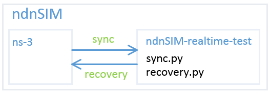

#ndnSIM-realtime-test
This repo record my experiment code for ndn realtime application.

This readme record how I manage my code.

##Frame

##Usage
This code based on ndnSIM v1.0, before using it, you need to see [http://ndnsim.net/1.0/](http://ndnsim.net/1.0/)

After download ndnSIM, download this repo at ndnSIM, and exec `recovery.py`, this code would be put in ns-3 in appropriate place.

And after modify the code in ns-3 and run the experiment, if you want to save it, use `sync.py` in `ndnSIM-realtime-test`, the code would be synchronized to `ndnSIM-realtime-test`.

You can jump to any of the position in your commitment at `ndnSIM-realtime-test`, and do the recovery job.